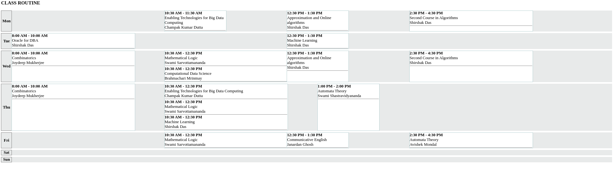

# php-timetable-in-dynamic-timeline
In this PHP class-routine/schedule each class is placed dynamically in various time of a day-timeline. Suppost a class starts at 10 AM , it will automatically be placed after 10 AM mark horizontally.

Example:

